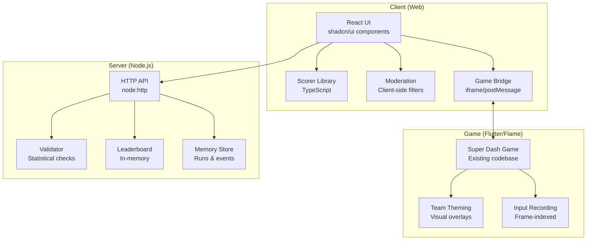

# Design Document

## Overview

Star System Sorter (S³) is a mobile native application built with React Native for UI and Flutter/Flame for the embedded Super Dash game. The app provides a deterministic star system classification system based on Human Design principles, team-based gaming with async competition, comprehensive moderation, and server-side validation with headless re-simulation.

**Key Design Principles:**
- **Leverage existing assets**: Maximize reuse of existing shadcn/ui components (adapted for React Native), Super Dash game, and design tokens
- **Modularity**: Small, focused files (60-120 LOC) with clear boundaries and acyclic dependencies
- **Determinism**: PCG32 RNG, fixed timestep, Q16.16 math for reproducible scoring and validation
- **Safety-first**: Comprehensive moderation across all user-generated content
- **Native-first**: React Native UI with Flutter native modules via MethodChannel/EventChannel bridge

## Architecture

### High-Level Architecture



### Technology Stack

**Frontend (React Native):**
- React Native 0.72+ with TypeScript
- React Native styling (StyleSheet) with design tokens from globals.css
- Existing shadcn/ui components adapted for React Native
- React Navigation for routing
- Zod (single source of truth for validation)
- react-hook-form + @hookform/resolvers for forms
- zustand (minimal: 2-3 global state atoms)
- Native compression APIs

**Game (Flutter/Flame Native Module):**
- Existing Super Dash game from `/Users/kingkamehameha/Documents/Kiro/GF App/super_dash`
- Flame engine for game logic
- Flutter module embedded as native module (Android/iOS)
- MethodChannel for commands, EventChannel for events
- Deterministic core: PCG32 RNG, fixed timestep (16.6667ms), Q16.16 math

**Backend (Node.js):**
- Node.js 20+ with TypeScript
- node:http (no Express)
- In-memory storage (no database)
- Zod for validation
- Headless re-simulator for deterministic validation

**Development Tools:**
- Jest for unit/integration testing
- Detox for E2E tests (native bridge, game flows)
- msw for mocking /api/* endpoints
- dependency-cruiser for enforcing import rules (no cycles, no deep imports)
- Zod for schema validation (runtime source of truth)
- zod-to-json-schema for generating JSON Schemas for docs

## Components and Interfaces

### 1. UI Layer (React)

#### State Management

**Global State (zustand):**
- Use zustand for minimal global state (2-3 atoms maximum)
- Atoms: `userSession`, `gameState`, `toastNotifications`
- Keep most state local to components
- Avoid over-using global state

**Form State (react-hook-form):**
- Use react-hook-form for all forms
- Integrate with Zod via @hookform/resolvers
- Zod schemas are single source of truth for validation
- Example:
```typescript
import { useForm } from 'react-hook-form';
import { zodResolver } from '@hookform/resolvers/zod';
import { z } from 'zod';

const schema = z.object({
  date: z.string().regex(/^\d{2}\/\d{2}\/\d{4}$/),
  time: z.string().regex(/^\d{2}:\d{2} (AM|PM)$/),
  location: z.string().min(1),
});

const form = useForm({
  resolver: zodResolver(schema),
});
```

**Compression (pako):**
- Use native CompressionStream when available
- Fallback to pako only if CompressionStream unavailable
- Guarded import pattern:
```typescript
async function compress(data: Uint8Array): Promise<Uint8Array> {
  if ('CompressionStream' in window) {
    // Use native compression
    const stream = new CompressionStream('gzip');
    // ... implementation
  } else {
    // Fallback to pako
    const pako = await import('pako');
    return pako.gzip(data);
  }
}
```

#### Component Hierarchy

```
App.tsx (existing, extend)
├── Router
│   ├── Onboarding Screen
│   ├── Input Screen
│   │   ├── Form (shadcn/ui)
│   │   └── FileUpload (shadcn/ui)
│   ├── Result Screen
│   │   ├── Card (shadcn/ui)
│   │   ├── RadialChart (custom)
│   │   └── Badge (shadcn/ui)
│   ├── Why Screen
│   ├── Profile Screen
│   ├── Settings Screen
│   ├── GameHub Screen
│   ├── TeamSelect Screen
│   │   └── StarSystemCrest (custom)
│   ├── Lobby Screen
│   ├── SuperDash Screen (game embed)
│   │   └── GameBridge (iframe wrapper)
│   ├── MatchResult Screen
│   └── Leaderboard Screen
│       └── Table (shadcn/ui)
└── Toast Provider (shadcn/ui)
```

#### Key Components to Create

**StarSystemCrest.tsx** (~80 LOC)
- Props: `{ system: string, size: 'sm' | 'md' | 'lg', variant: 'default' | 'outlined' }`
- Renders SVG crest for each star system
- Uses existing ImageWithFallback for error handling

**RadialChart.tsx** (~100 LOC)
- Props: `{ percentage: number, label: string, color: string }`
- SVG-based radial progress chart
- Animated on mount

**GameBridge.tsx** (~120 LOC)
- Wraps iframe containing Flutter web build
- Handles postMessage communication with origin allowlist
- Manages game lifecycle (start/pause/resume/quit)
- Emits typed events to parent
- Implements timeout/retry logic (expects `ready` within N seconds)
- Applies iframe sandbox: `allow-scripts allow-pointer-lock allow-same-origin`

**ScoreDisplay.tsx** (~60 LOC)
- Props: `{ primary: string, percentage: number, allies: Array<{system: string, pct: number}> }`
- Uses Card, Badge components from shadcn/ui
- Shows disclaimer text

#### Reuse Existing Components

From `components/ui`:
- Button, Card, Input, Form, Select, Dialog, Tabs
- Alert, Badge, Checkbox, Label, Separator
- Table, Toast, Tooltip, Progress
- Dropdown Menu, Popover, Sheet

From `components/figma`:
- ImageWithFallback for crest images

### 2. Scorer Library (TypeScript)

**Location:** `src/scorer/`

**Files:**
- `types.ts` (~80 LOC): HD extract types, canon types, result types
- `canon.ts` (~100 LOC): Load and validate mock canon YAML
- `score.ts` (~120 LOC): Core scoring algorithm
- `tie.ts` (~80 LOC): Tie-breaking logic
- `checksum.ts` (~60 LOC): Canon checksum computation
- `index.ts` (~40 LOC): Public API exports

**Key Interfaces:**

```typescript
// types.ts
export interface HDExtract {
  type: string;
  authority: string;
  profile: string;
  centers: string[];
  channels: number[];
  gates: number[];
}

export interface Canon {
  version: string;
  systems: Record<string, SystemWeights>;
}

export interface SystemWeights {
  weights: Record<string, number>;
  why: string;
}

export interface ScorerResult {
  classification: 'primary' | 'hybrid' | 'unresolved';
  primary?: string;
  hybrid?: [string, string];
  allies: Array<{ system: string; percentage: number }>;
  percentages: Record<string, number>;
  contributorsPerSystem: Record<string, string[]>;
  meta: {
    canonVersion: string;
    canonChecksum: string;
  };
}

export interface TiePolicy {
  leadPct: number;
  minPrimaryPct: number;
  hybridWindowPct: number;
}
```

**Scoring Algorithm:**

1. Load canon and compute checksum
2. For each system, compute weighted score from HD extract
3. Normalize scores to percentages (0.1% precision)
4. Apply tie policy:
   - If lead > hybridWindowPct: primary classification
   - If lead <= hybridWindowPct: hybrid classification
   - Tie-break by contributor count, then lexicographic order
5. Return result with meta information

### 3. Moderation System (TypeScript)

**Location:** `src/moderation/`

**Files:**
- `types.ts` (~60 LOC): ModResult, context types
- `blocklists.ts` (~100 LOC): Pattern lists for hard/soft blocks
- `sanitizer.ts` (~120 LOC): Text and prompt sanitization
- `service.ts` (~150 LOC): ModerationService class
- `index.ts` (~40 LOC): Public API exports

**Key Interfaces:**

```typescript
// types.ts
export interface ModResult {
  decision: 'allow' | 'soft_block' | 'hard_block' | 'review';
  reasons: string[];
  severity: number;
  redactions?: string[];
}

export interface ModContext {
  type: 'dm' | 'room' | 'post' | 'avatar_prompt' | 'avatar_image';
  authorId: string;
  timestamp: number;
}

// service.ts
export class ModerationService {
  checkText(params: {
    text: string;
    context: ModContext;
    authorId: string;
  }): ModResult;
  
  checkImage(params: {
    prompt?: string;
    bytes?: Uint8Array;
    context: ModContext;
    authorId: string;
  }): ModResult;
  
  checkRateLimit(authorId: string, action: string): boolean;
}
```

**Moderation Pipeline:**

1. **Pre-filter (client)**: Basic pattern matching against blocklists
2. **Server check**: More comprehensive validation
3. **Decision handlers**:
   - `allow`: Deliver content
   - `soft_block`: Show "Please rephrase..." message
   - `hard_block`: Show policy violation message
   - `review`: Queue for admin review
4. **Rate limiting**: Track actions per user per time window

### 4. Native Game Bridge (React Native ↔ Flutter via MethodChannel/EventChannel)

**Location:** `src/bridge/`

**Files:**
- `GameBridge.ts` (~120 LOC): React Native module wrapper for native bridge
- `types.ts` (~80 LOC): Message schemas
- `protocol.ts` (~100 LOC): Message validation and serialization

**Native Bridge Files (Android):**
- `android/app/src/main/java/com/s3/GameBridgeModule.java` (~150 LOC): Native module
- `android/app/src/main/java/com/s3/GameBridgePackage.java` (~40 LOC): Package registration
- `android/app/src/main/java/com/s3/MainActivity.java` (modify): FlutterEngine caching

**Native Bridge Files (iOS):**
- `ios/S3/GameBridgeModule.m` (~150 LOC): Native module
- `ios/S3/AppDelegate.m` (modify): FlutterEngine caching

**Message Protocol:**

```typescript
// types.ts
export type GameCommand =
  | { type: 'start'; payload: { game: 'super_dash'; seed: string; team: string } }
  | { type: 'pause' }
  | { type: 'resume' }
  | { type: 'quit' }
  | { type: 'set-music'; payload: { pack: string } };

export type GameEvent =
  | { type: 'ready' }
  | { type: 'result'; payload: GameResult }
  | { type: 'error'; payload: { code: string; message: string } }
  | { type: 'state'; payload: { fps: number } };

export interface GameResult {
  game: 'super_dash';
  score: number;
  durationMs: number;
  suspect: false;
  clientHash: string; // SHA256({seed, inputs, game_core_version})
  game_core_version: string;
  metrics: {
    distance: number;
    coins: number;
    jumps: number;
  };
}
```

**Communication Flow:**

1. React Native calls `NativeModules.GameBridge.open(game, seed, team)`
2. Native module launches Flutter activity/view controller with cached FlutterEngine
3. Flutter sends `ready` event via EventChannel
   - RN expects `ready` within N seconds (configurable timeout)
   - On timeout: show retry UI
4. RN sends `start` command via MethodChannel with seed and team
5. Game runs with deterministic core:
   - PCG32 RNG with 64-bit seed (hex)
   - Fixed timestep 16.6667ms, frame index as time source
   - Q16.16 fixed-point math for physics/scoring
   - Records frame-indexed inputs with RLE/delta compression
6. Game completes, sends `result` event via EventChannel with clientHash
7. RN processes result and submits to server for re-simulation

**Native Bridge API:**

```typescript
// GameBridge.ts
import { NativeModules, NativeEventEmitter, DeviceEventEmitter, Platform } from 'react-native';

const { GameBridge: GameBridgeModule } = NativeModules;
const eventEmitter = Platform.OS === 'ios' 
  ? new NativeEventEmitter(GameBridgeModule)
  : DeviceEventEmitter;

export const GameBridge = {
  open(game: string, seed: string, team: string): Promise<void> {
    return GameBridgeModule.open(game, seed, team);
  },
  
  sendCommand(command: GameCommand): Promise<void> {
    return GameBridgeModule.sendCommand(JSON.stringify(command));
  },
  
  addEventListener(callback: (event: GameEvent) => void): () => void {
    const subscription = eventEmitter.addListener('GameEvent', callback);
    return () => subscription.remove();
  }
};
```

### 5. Super Dash Integration (Flutter/Flame Native Module)

**Location:** `/Users/kingkamehameha/Documents/Kiro/GF App/super_dash` (existing)

**Module Structure:** Flutter module embedded as native Android/iOS module

**Adapter Layer (Dependency Injection):**

The existing Super Dash game will be adapted via DI to inject deterministic components without rewriting core logic. Replace any `Random()` and `DateTime.now()` usage with injected interfaces.

**New Files to Add:**

**lib/bridge/method_channel_bridge.dart** (~120 LOC)
- Set up MethodChannel `s3/game/cmd` for receiving commands
- Set up EventChannel `s3/game/events` for sending events
- Parse and validate commands against schema
- Send events back to React Native via EventChannel
- Handle errors gracefully with error events

**lib/bridge/schema.dart** (~80 LOC)
- Dart classes for GameCommand and GameEvent
- JSON serialization/deserialization with `dart:convert`
- Validation logic using pattern matching
- Type-safe command/event builders

**lib/core/seeded_rng.dart** (~80 LOC)
- PCG32 implementation with documented constants
- 64-bit seed (hex string input)
- Implements `Random` interface for drop-in replacement
- Deterministic sequence for given seed

**lib/core/fixed_timestep.dart** (~60 LOC)
- Fixed timestep loop at 16.6667ms (60 FPS)
- Frame index as time source (no `DateTime.now()`)
- Accumulator pattern for consistent updates

**lib/core/fixed_point.dart** (~80 LOC)
- Q16.16 fixed-point arithmetic helpers
- Conversion to/from double
- Math operations (add, mul, div) with fixed precision

**lib/core/input_recorder.dart** (~100 LOC)
- Record frame-indexed inputs (jump/dash with frame number)
- RLE/delta compression for efficient storage
- Compute clientHash: SHA256({seed, inputs, game_core_version})
- Serialize to JSON for submission

**lib/theming/team_theme.dart** (~120 LOC)
- Map team name to color palette from design tokens
- Apply visual overlays (particles, trails, effects)
- Modify UI elements (HUD colors, backgrounds)
- Load team-specific assets if needed

**lib/adapter/game_adapter.dart** (~100 LOC)
- Dependency injection container
- Provides: seeded RNG, fixed timestep, input recorder, team theme
- Replaces default implementations in game initialization
- Minimal changes to existing game code

**main.dart** (modify existing, ~50 LOC changes)
- Initialize message bus on web platform
- Handle `start` command: apply seed, inject adapter, apply theme
- Handle `pause`/`resume`/`quit` commands: control game loop
- Send `ready` event on initialization
- Send `result` event on game end with clientHash and metrics
- Send `error` events on failures

### 6. Server API (Node.js)

**Location:** `apps/server/src/`

**Files:**
- `http.ts` (~80 LOC): HTTP server setup
- `routes/runs.ts` (~150 LOC): POST /api/runs/submit
- `routes/events.ts` (~60 LOC): GET /api/events/active
- `routes/leaderboard.ts` (~120 LOC): GET /api/leaderboard/daily
- `routes/music.ts` (~80 LOC): GET /api/music/packs, POST /api/music/prefs
- `store/memory.ts` (~100 LOC): In-memory data store
- `validate.ts` (~150 LOC): Statistical validation logic
- `index.ts` (~60 LOC): Server entry point

**API Endpoints:**

**POST /api/runs/submit**
```typescript
Request: {
  game_key: 'super_dash';
  event_id: string;
  team_id: string;
  seed: string;
  inputs: string; // compressed
  client_hash: string;
  game_core_version: string;
  nonce: string;
  clientTimestamp: number;
  metrics: {
    distance: number;
    coins: number;
    jumps: number;
  };
}

Response: {
  score: number;
  validated: boolean;
  suspect: boolean;
  reason?: string;
}
```

**GET /api/leaderboard/daily?event_id=...**
```typescript
Response: {
  event_id: string;
  date: string;
  teams: Array<{
    team_id: string;
    team_name: string;
    score: number;
    rank: number;
    top_runs: number;
    median_score: number;
    total_runs: number;
  }>;
}
```

**GET /api/events/active**
```typescript
Response: {
  events: Array<{
    id: string;
    name: string;
    start_date: string;
    end_date: string;
    game_key: string;
  }>;
}
```

**Validation Logic:**

1. Verify game_core_version matches expected
2. Check nonce hasn't been used (replay protection)
3. Validate metrics are within statistical bounds:
   - Max distance per duration
   - Max coins per distance
   - Max jumps per duration
4. Compute score from metrics
5. Compare to client score (tolerance: 1% or 5 pts)
6. Mark suspect if anomalies detected
7. Store run and update leaderboard

**Leaderboard Aggregation:**

```typescript
function computeDailyTeamScore(runs: Run[]): number {
  const N = runs.length;
  const K = Math.max(5, Math.min(25, Math.round(Math.sqrt(N))));
  
  const sorted = runs.sort((a, b) => b.score - a.score);
  const topK = sorted.slice(0, K);
  const sumTopK = topK.reduce((sum, r) => sum + r.score, 0);
  
  const median = sorted[Math.floor(N / 2)].score;
  
  return sumTopK + median;
}
```

## Data Models

### In-Memory Store Schema

```typescript
// store/memory.ts
interface MemoryStore {
  runs: Map<string, Run>;
  events: Map<string, Event>;
  leaderboards: Map<string, DailyLeaderboard>;
  musicPrefs: Map<string, MusicPref>;
  nonces: Set<string>;
}

interface Run {
  id: string;
  event_id: string;
  team_id: string;
  user_id: string;
  game_key: string;
  seed: string;
  inputs: string;
  client_hash: string;
  game_core_version: string;
  score: number;
  duration_ms: number;
  metrics: Record<string, number>;
  validated: boolean;
  suspect: boolean;
  created_at: number;
}

interface Event {
  id: string;
  name: string;
  game_key: string;
  start_date: string;
  end_date: string;
  active: boolean;
}

interface DailyLeaderboard {
  event_id: string;
  date: string;
  teams: Map<string, TeamScore>;
}

interface TeamScore {
  team_id: string;
  team_name: string;
  score: number;
  runs: string[]; // run IDs
}

interface MusicPref {
  user_id: string;
  pack: string;
}
```

### Mock Canon Data

```yaml
# scorer/canon.mock.yaml
version: "0.1.0"
systems:
  Pleiades:
    weights:
      type_manifestor: 15
      type_generator: 10
      authority_emotional: 12
      profile_1_3: 8
      center_sacral_defined: 10
      channel_34_57: 20
      gate_1: 5
    why: "Manifestors with emotional authority and channel 34-57 show strong Pleiadian alignment"
  
  Sirius:
    weights:
      type_projector: 15
      authority_splenic: 12
      profile_2_4: 10
      center_spleen_defined: 10
      channel_18_58: 18
      gate_2: 5
    why: "Projectors with splenic authority and channel 18-58 show strong Sirian alignment"
  
  # ... more systems
```

## Error Handling

### Client-Side Errors

**Scorer Errors:**
- Invalid HD extract format → Show "Invalid chart data" message
- Canon load failure → Show "System error, please try again"
- Computation error → Log to console, show generic error

**Moderation Errors:**
- Soft block → Show "Please rephrase..." with retry
- Hard block → Show policy violation, no retry
- Rate limit → Show "Too many requests, please wait"

**Game Bridge Errors:**
- Flutter load failure → Show "Game failed to load" with retry button
- Communication timeout → Show "Connection lost" with reconnect
- Invalid message → Log warning, ignore message

### Server-Side Errors

**Validation Errors:**
- Invalid schema → 400 Bad Request with field errors
- Missing game version → 400 "Game version required"
- Replay attack (nonce reuse) → 409 Conflict
- Anomaly detected → 200 OK with `suspect: true`

**Storage Errors:**
- Memory limit reached → 507 Insufficient Storage
- Concurrent modification → Retry with exponential backoff

**Error Response Format:**
```typescript
{
  error: {
    code: string;
    message: string;
    details?: Record<string, any>;
  }
}
```

## Testing Strategy

### Unit Tests

**Scorer (`tests/scorer.test.ts`):**
- Test each system's scoring with known inputs
- Test tie-breaking logic with edge cases
- Test canon checksum computation
- Golden fixtures: known HD extracts → expected results

**Moderation (`tests/moderation.test.ts`):**
- Test blocklist patterns (hard/soft)
- Test avatar prompt sanitization
- Test rate limiting logic
- Test decision handlers

**Validator (`packages/games-headless/tests/headless.test.ts`):**
- Test headless re-simulation with PCG32 RNG
- Test score computation from metrics
- Test determinism: Dart vs Node produce identical scores
- Golden fixtures: {seed, inputs, version} → expected score
- Tolerance validation: abs(client - server) <= min(1%, 5 pts)

### Integration Tests

**Bridge Contract (`tests/bridge.contract.test.ts`):**
- Test postMessage serialization/deserialization
- Test command validation with origin checking
- Test event emission from iframe
- Golden JSON fixtures for all command/event types
- Test timeout and retry logic

**API (`apps/server/tests/api.test.ts`):**
- Test each endpoint with valid/invalid inputs
- Test leaderboard aggregation formula
- Test nonce replay protection
- Test concurrent submissions
- Test CORS with allowed origins

### E2E Tests (Playwright)

**User Flows:**
- Onboarding → Input → Result → Why
- GameHub → TeamSelect → Lobby → SuperDash → MatchResult
- Leaderboard viewing and filtering

**Game Integration:**
- Iframe handshake: ready → start → result path
- Start game with seed via postMessage
- Verify deterministic behavior (same seed → same result)
- Verify result submission to server
- Check leaderboard update
- Test pause/resume/quit commands

### Coverage Targets

- Scorer: ≥80%
- Moderation: ≥80%
- Validator: ≥80%
- App-wide: ≥60%

### CI Pipeline

```yaml
# .github/workflows/ci.yml
name: CI
on: [push, pull_request]
jobs:
  test:
    runs-on: ubuntu-latest
    steps:
      - uses: actions/checkout@v3
      - uses: actions/setup-node@v3
      - run: npm install
      - run: npm run lint
      - run: npm run typecheck
      - run: npm run test
      - run: npm run test:coverage
      - run: npm run validate:schemas
      - run: npm run validate:imports
```

## Security Considerations

### PII Handling

- **Never store**: Birth data in logs or analytics
- **Hash user IDs**: Use SHA256 for logs and metrics
- **Retention**: 90 days for runs, 30 days for flagged content
- **Purge**: Automatic deletion after retention period

### Content Moderation

- **Pre-generation**: Sanitize avatar prompts before sending to generator
- **Post-generation**: Check generated images before display
- **Audit log**: Track all moderation actions (actor, action, reason, timestamp)
- **Admin UI**: Stub interface for reviewing flagged content

### Anti-Cheat

- **Nonce**: Prevent replay attacks
- **Rate limiting**: Prevent spam submissions
- **Statistical validation**: Detect impossible scores/metrics
- **Version checking**: Reject mismatched game versions

### API Security

- **Input validation**: Zod schemas for all endpoints
- **Payload size**: 200KB limit (compressed)
- **Rate limiting**: Per-user and per-IP limits
- **CORS**: Whitelist allowed origins

## Performance Considerations

### Client Performance

- **Code splitting**: Lazy load screens with React.lazy()
- **Asset optimization**: Compress images, use WebP
- **Bundle size**: Target <500KB initial bundle
- **Render optimization**: Memoize expensive components

### Game Performance

- **Target FPS**: ≥55 FPS, never <45 for >1s
- **Memory**: ≤350MB peak on mid-tier devices
- **Load time**: <3s for game initialization

### Server Performance

- **In-memory storage**: Fast reads/writes, no DB overhead
- **Leaderboard caching**: Recompute only on new submissions
- **Concurrent requests**: Handle 100+ req/s
- **Memory management**: Periodic cleanup of old data

## Deployment Strategy

### Development

```bash
# Start all services
npm run dev

# Individual services
npm run dev:web      # Vite dev server (port 5173)
npm run dev:game     # Flutter web build (port 8080)
npm run dev:server   # Node server (port 3000)
```

### Production Build

```bash
# Build web app
npm run build:web

# Build Flutter game
cd super_dash && flutter build web --release

# Build server
npm run build:server

# Deploy
npm run deploy
```

### Environment Variables

```bash
# .env
NODE_ENV=production
PORT=3000
GAME_URL=https://game.example.com
ALLOWED_ORIGINS=https://app.example.com
MAX_PAYLOAD_SIZE=204800
```

## Future Enhancements

### Phase 2 (Post-MVP)

- **Full determinism**: Headless re-simulation in Node
- **Ghost replay**: Render teammate runs as translucent overlays
- **Real-time multiplayer**: WebSocket-based live races
- **Authentication**: User accounts and profiles
- **Payments**: Premium features and cosmetics
- **Push notifications**: Event reminders and results
- **Analytics**: Privacy-respecting usage metrics

### Phase 3 (Long-term)

- **Native mobile apps**: React Native for iOS/Android
- **More games**: Additional mini-games beyond Super Dash
- **Social features**: Friends, teams, chat
- **Tournaments**: Scheduled competitive events
- **Achievements**: Badges and progression systems
- **Localization**: Multi-language support

## Open Questions

1. **Super Dash RNG**: Does the existing game use seeded RNG? If not, how difficult to add?
2. **Input recording**: What's the best way to capture inputs without modifying core game logic?
3. **Team theming**: Should visual changes be subtle overlays or more dramatic reskins?
4. **Leaderboard reset**: Daily? Weekly? Both?
5. **Music licensing**: What's the plan for soundtrack packs?
6. **Hosting**: Where will Flutter web build be hosted? Same domain or separate?

## Design Decisions and Rationales

### Why Web React + Tailwind/shadcn?

- **Leverage existing components**: 40+ shadcn/ui components already built
- **Existing styling**: globals.css with design tokens ready to use
- **Faster iteration**: Web dev tools, hot reload, and Vite
- **Easier Flutter integration**: iframe embedding simpler than native modules
- **Future flexibility**: Can wrap in Electron/Tauri for desktop, or Capacitor for mobile

### Why In-Memory Storage Instead of Database?

- **MVP simplicity**: No DB setup, migrations, or ORM
- **Fast development**: Direct object manipulation
- **Sufficient for testing**: Can handle thousands of runs
- **Easy migration**: Clear interfaces make DB swap straightforward later

### Why Deterministic Core Now (Not Later)?

- **Fair competition**: Headless re-simulation prevents cheating
- **Adapter pattern**: Inject deterministic components via DI without rewriting game
- **PCG32 + fixed timestep**: Well-understood techniques for determinism
- **Cross-lang validation**: Dart and Node produce identical scores for same inputs
- **Trust**: Players trust validated leaderboards more than statistical checks

### Why PostMessage for iframe Communication?

- **Web-native**: Standard browser API, no plugins needed
- **Security**: Origin validation prevents unauthorized access
- **Easy testing**: Can mock postMessage in unit tests
- **Cross-browser**: Works consistently across all modern browsers
- **Sandboxing**: iframe sandbox attribute provides additional security

## Appendix A: Message Schemas (JSON Examples)

### Commands (Parent → iframe)

**Start Command:**
```json
{
  "type": "start",
  "payload": {
    "game": "super_dash",
    "seed": "a1b2c3d4e5f67890",
    "team": "Pleiades"
  }
}
```

**Pause Command:**
```json
{
  "type": "pause"
}
```

**Resume Command:**
```json
{
  "type": "resume"
}
```

**Quit Command:**
```json
{
  "type": "quit"
}
```

**Set Music Command:**
```json
{
  "type": "set-music",
  "payload": {
    "pack": "Sirius"
  }
}
```

### Events (iframe → Parent)

**Ready Event:**
```json
{
  "type": "ready"
}
```

**State Event:**
```json
{
  "type": "state",
  "payload": {
    "fps": 60
  }
}
```

**Result Event:**
```json
{
  "type": "result",
  "payload": {
    "game": "super_dash",
    "score": 12450,
    "durationMs": 284000,
    "suspect": false,
    "clientHash": "a3f5b8c2d1e4f6a7b8c9d0e1f2a3b4c5d6e7f8a9b0c1d2e3f4a5b6c7d8e9f0a1",
    "game_core_version": "1.0.0",
    "metrics": {
      "distance": 5420,
      "coins": 121,
      "jumps": 87
    }
  }
}
```

**Error Event:**
```json
{
  "type": "error",
  "payload": {
    "code": "CHEAT_DETECTED",
    "message": "Invalid input sequence detected"
  }
}
```

## Appendix B: Integration Checklist

### Flutter Web Build

**Build Command:**
```bash
cd /Users/kingkamehameha/Documents/Kiro/GF\ App/super_dash
flutter build web --release --web-renderer canvaskit
```

**Output Location:**
```
super_dash/build/web/
├── index.html
├── main.dart.js
├── flutter.js
├── canvaskit/
└── assets/
```

### Hosting Options

**Option 1: Subdomain**
- Game hosted at: `https://game.example.com`
- App hosted at: `https://app.example.com`
- CORS: Allow `app.example.com` origin
- Env var: `GAME_ORIGIN=https://game.example.com`

**Option 2: Subpath**
- Game hosted at: `https://example.com/game/`
- App hosted at: `https://example.com/`
- Same origin, no CORS needed
- Env var: `GAME_ORIGIN=https://example.com`

### iframe Configuration

**HTML:**
```html
<iframe
  id="game-frame"
  src={process.env.GAME_ORIGIN}
  sandbox="allow-scripts allow-pointer-lock allow-same-origin"
  allow="gamepad; fullscreen"
  style={{ width: '100%', height: '100vh', border: 'none' }}
/>
```

**Environment Variables:**
```bash
# .env
VITE_GAME_ORIGIN=http://localhost:8080  # Dev
# VITE_GAME_ORIGIN=https://game.example.com  # Prod
```

### Super Dash Adapter Files

**Required New Files:**
1. `lib/bridge/message_bus.dart` - postMessage in/out
2. `lib/bridge/schema.dart` - Command/event models + JSON
3. `lib/core/seeded_rng.dart` - PCG32 implementation
4. `lib/core/fixed_timestep.dart` - 16.6667ms loop
5. `lib/core/fixed_point.dart` - Q16.16 math helpers
6. `lib/core/input_recorder.dart` - Timeline + RLE + hash
7. `lib/theming/team_theme.dart` - Colors from tokens
8. `lib/adapter/game_adapter.dart` - DI container

**Modified Files:**
1. `lib/main.dart` - Wire start/pause/resume/quit, send ready/result events

### Security Configuration

**CORS (Server):**
```typescript
// apps/server/src/http.ts
const ALLOWED_ORIGINS = [
  process.env.APP_ORIGIN || 'http://localhost:5173',
];

res.setHeader('Access-Control-Allow-Origin', ALLOWED_ORIGINS[0]);
res.setHeader('Access-Control-Allow-Methods', 'GET, POST, OPTIONS');
res.setHeader('Access-Control-Allow-Headers', 'Content-Type');
```

**Origin Validation (Client):**
```typescript
// src/bridge/protocol.ts
const ALLOWED_GAME_ORIGINS = [
  import.meta.env.VITE_GAME_ORIGIN,
];

window.addEventListener('message', (event) => {
  if (!ALLOWED_GAME_ORIGINS.includes(event.origin)) {
    console.warn('Rejected message from:', event.origin);
    return;
  }
  // Process message
});
```

### Compliance

- **No remote execution**: Bundle all game assets in Flutter web build
- **Version gating**: Reject runs with mismatched `game_core_version`
- **Sandbox**: Use `allow-scripts allow-pointer-lock allow-same-origin` (tune as needed)
- **Music licensing**: Placeholder packs until licensed

## Diff Summary

**Major Changes:**
1. **Platform**: Changed from "React Native mobile app" to "Web React + TypeScript + Tailwind/shadcn"
2. **Game Integration**: Changed from "native bridge (Android/iOS)" to "iframe + postMessage (web)"
3. **Determinism**: Moved from "Phase 2 future enhancement" to "MVP requirement with PCG32, fixed timestep, Q16.16 math"
4. **Super Dash Reuse**: Added explicit path `/Users/kingkamehameha/Documents/Kiro/GF App/super_dash` and adapter pattern via DI
5. **Bridge Spec**: Added origin allowlist, sandbox guidance, timeout/retry logic
6. **Server**: Added headless re-simulation requirement (not just statistical validation)
7. **Testing**: Replaced native bridge tests with postMessage contract tests and Playwright E2E
8. **Performance**: Updated targets for web (cold start <3s, game init <3s)
9. **Security**: Added CORS, origin validation, iframe sandbox recommendations
10. **Deliverables**: Added Appendix A (Message Schemas) and Appendix B (Integration Checklist)

**Unchanged:**
- Moderation rules and retention policies
- Leaderboard aggregation formula
- Rate limiting rules
- PII handling and security policies
- File size limits (≤150 LOC, prefer 60-120)
- Test coverage targets (≥80% core, ≥60% app-wide)
- Accessibility requirements (WCAG AA, 44px touch targets)

## Conclusion

This design leverages existing assets (shadcn/ui components, Super Dash game, globals.css) to build a web app with minimal new code. The modular architecture with small files, clear boundaries, and comprehensive testing ensures maintainability. The scorer provides deterministic classification, moderation ensures safety, and the server validates gameplay via headless re-simulation for fair competition.

Key success metrics:
- ✅ Reuse 40+ existing shadcn/ui components
- ✅ Integrate Super Dash with <500 LOC of adapter code
- ✅ All files ≤150 LOC (prefer 60-120)
- ✅ Cyclomatic complexity ≤10 per function
- ✅ Test coverage: ≥80% for core, ≥60% app-wide
- ✅ Acyclic import graph with enforced layering
- ✅ Web performance: cold start <3s, game init <3s, FPS ≥55
- ✅ Deterministic validation: Dart and Node produce identical scores
